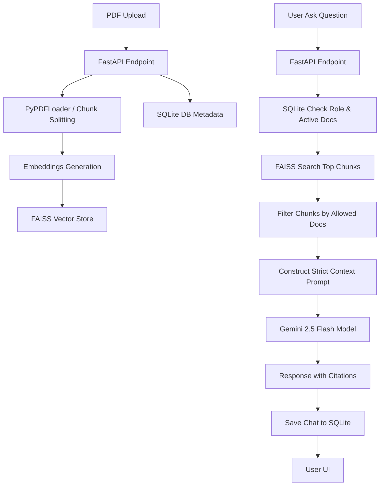

# Restaurant SOP Bot & Compliance Portal

An enterprise-grade, internal AI assistant designed to streamline compliance, food safety, kitchen hygiene, and service operations in a restaurant environment. 

This project solves the challenge of training staff and enforcing Standard Operating Procedures (SOPs) by providing role-based, cited, and audited compliance answers through a Retrieval-Augmented Generation (RAG) assistant.

---

## 🍽️ The Problem & Use Case

Restaurant operations are subject to high staff turnover, strict food safety regulations, and complex operational procedures. Keeping kitchen staff, service staff, and management aligned on SOPs is difficult:
- **General Staff** need quick answers to operational questions (e.g., handling spills, food prep hygiene, dress codes) without reading through massive binders.
- **Role Divisions** require that staff only access procedures relevant to their responsibilities (e.g., servers do not need kitchen recipes, and kitchen staff do not need POS service manuals).
- **Managers** must be able to upload, update, activate/deactivate SOP documents, customize access permissions, and audit the quality of answers.

The **Restaurant SOP Bot** addresses these needs by combining semantic search over PDF manuals with a role-based access control engine, backed by LLM-generated answers and a built-in quality auditing loop.

---

## 🛠️ Technology Stack

The application utilizes a premium, lightweight, and modern stack:

1. **Frontend Interface (Streamlit)**: Builds a beautiful, interactive, custom dark-themed web interface with native chat bubbles, inline feedback controls, and an administrative panel.
2. **Backend API (FastAPI)**: Coordinates endpoints for user authentication, document uploads, RAG queries, feedback logging, history, and analytics.
3. **Database (SQLite)**: Provides session persistence for document metadata, versioning, audit logging, and quality feedback records.
4. **Embedding Model (`sentence-transformers/all-MiniLM-L6-v2`)**: Generates high-quality local semantic embeddings for document text chunks.
5. **Vector Index (FAISS)**: Offers CPU-based similarity search to find the most relevant SOP document sections.
6. **LLM Engine (Gemini 2.5 Flash)**: Synthesizes responses based strictly on the retrieved context chunks using the Google GenAI SDK.
7. **Orchestration (LangChain)**: Simplifies PDF loading, recursive character chunk splitting, and vector store indexing/loading.

---

## ⚙️ Core System Architecture & RAG Pipeline



### 1. Document Ingestion & Reindexing
- PDFs are parsed and split into overlapping chunks ($700$ characters, $100$ character overlap) to preserve context.
- Chunk source filenames are clean-mapped in metadata.
- Toggling, deleting, or uploading a document automatically triggers a clean, on-disk rebuild of the FAISS vector database to ensure absolute synchronization.

### 2. Role-Based Search Filtering
- On a user query, the RAG engine queries FAISS for the top $15$ chunks.
- Chunks are filtered on the backend in Python: only chunks originating from documents currently marked as **Active** and **Allowed** for the user's role (Manager, Kitchen, or Server) are retained.
- The top $4$ allowed chunks are compiled into the LLM context.

### 3. Citations & Auditing Loop
- Answers include sources (e.g. `Kitchen SOP (Page 3)`).
- Every query is logged to `chat_history` along with the response time, question, answer, and citations.
- Users can submit thumbs up/down and text comments directly matching the logged chat ID.

---

## 📂 Directory Structure

```text
Restaurant- BOT/
├── backend/
│   ├── data/                 # SQLite database and FAISS index cache
│   ├── uploads/              # Saved physical PDF manuals
│   ├── auth.py               # Predefined user credentials & role checks
│   ├── database.py           # SQLite schema init & DB helper functions
│   ├── main.py               # FastAPI REST endpoints
│   ├── rag.py                # LangChain parsing, FAISS, and Gemini client
│   └── requirements.txt      # Python dependencies
├── frontend/
│   └── app.py                # Streamlit UI & interactive dashboard
├── README.md                 # Project guide
└── Princeshrivenkateshwara...# Reference allocation description PDF
```

---

## 🔑 Predefined User Accounts & Roles

The system is pre-seeded with three demo users having access-restricted scopes:

| Username | Password | Role | Allowed Document Scopes | Can Access Admin Panel |
| :--- | :--- | :--- | :--- | :---: |
| `manager1` | `1234` | `manager` | **All Documents** (automatically) | **Yes** |
| `chef1` | `1234` | `kitchen` | Documents mapped to `kitchen` | No |
| `waiter1` | `1234` | `server` | Documents mapped to `server` | No |

---

## 🚀 Setup & Launch Instructions

### Prerequisites
- Python 3.10 or 3.11 installed.
- A valid Google Gemini API Key.

### 1. Configure the Environment
Navigate to the `backend` folder and edit the `.env` file to add your Google API key:
```env
GOOGLE_API_KEY=your_gemini_api_key_here
```

### 2. Start the Backend API
Navigate to the `backend` directory, install the required libraries, and start the FastAPI uvicorn server:
```powershell
cd backend
pip install -r requirements.txt
uvicorn main:app --host 127.0.0.1 --port 8000 --reload
```

### 3. Start the Streamlit Frontend
In a new terminal window, navigate to the `frontend` directory and start Streamlit:
```powershell
cd frontend
streamlit run app.py --server.port 8501
```

Once running, open your web browser and navigate to `http://localhost:8501`.

---

## 🔒 Security & Policy Adherence
- **Strict Grounding**: The LLM is restricted via system prompts to answer *only* from the provided context. If the query isn't answered in the SOP docs, it replies: `"Question unrelated to SOP or insufficient information available."`
- **Data Protection**: Secrets are loaded exclusively from `.env`.
- **Traceability**: All interactions are logged in SQLite for compliance audit verification.
